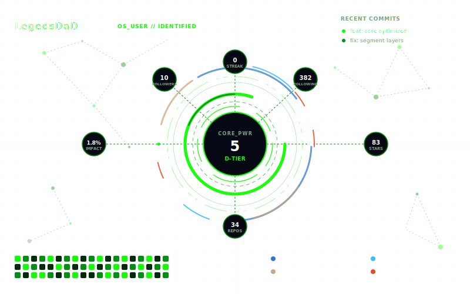

<!-- my-badges start -->
<a href="my-badges/a-commit.md"></a>
<a href="my-badges/ab-commit.md"></a>
<a href="my-badges/cafe-commit.md"></a>
<a href="my-badges/dead-commit.md"></a>
<a href="my-badges/favorite-word.md"></a>
<a href="my-badges/fix-3.md"></a>
<a href="my-badges/fix-5.md"></a>
<a href="my-badges/fix-6+.md"></a>
<a href="my-badges/fix-2.md"></a>
<a href="my-badges/friday-13.md"></a>
<a href="my-badges/mass-delete-commit.md"></a>
<a href="my-badges/pi-day.md"></a>
<a href="my-badges/rebel-coder.md"></a>
<a href="my-badges/science-fiction-day.md"></a>
<a href="my-badges/self-star.md"></a>
<a href="my-badges/morning-commits.md"></a>
<a href="my-badges/evening-commits.md"></a>
<a href="my-badges/midnight-commits.md"></a>
<a href="my-badges/emoji-only-commit.md"></a>
<a href="my-badges/yeti.md"></a>
<!-- my-badges end -->


<br/>

[](https://git.io/typing-svg)

<br/>


</div>

---


# 💻 Tech Stack

<div align="center">


<br/>


</div>

---


# 📊 Profile Analytics

<div align="center">


</div>

---


# 🏆 GitHub Trophies


# 👨‍💻 About Me


```yaml
Name: LegedsDaD
Role: Full Stack Python Developer

Focus:
  - AI Agents
  - Automation
  - Developer Tools
  - High Performance Applications

Currently Learning:
  - LLM Integrations
  - Advanced UI/UX
  - AI Workspaces

Goals:
  - Build innovative developer tools
  - Create powerful local AI systems
  - Contribute to open source
```

<br clear="both"/>

---


# 🚀 Featured Projects

<div align="center">

| Project | Description |
|---|---|
| 🎮 **[Simple Game Engine](https://github.com/LegedsDaD/Simple-The_Game_Engine)** | Lightweight Python-based game engine |
| 🤖 **[Easier Bot](https://github.com/LegedsDaD/EasierBot)** | Automation bot for repetitive tasks |
| 📐 **[Calculus](https://github.com/LegedsDaD/CalCulus)** | Mathematical tools & calculations |
| 🌌 **[Three Dimensions](https://github.com/LegedsDaD/ThreeDimensions)** | 3D visualization experiments |
| 🎨 **[True Graphics](https://github.com/LegedsDaD/TrueGraphics)** | Graphics rendering for Windows |

</div>

---


# 🧠 Currently Building

<div align="center">

  
</div>

- 🤖 Building **AgentDesk** – Local AI Workspace for Developers  
- ⚡ Creating **high-performance Python tools**  
- 🧪 Experimenting with **AI agents & LLM automation**  
- 🛠️ Improving **developer-friendly GUIs**  
- 🚀 Exploring **real-world AI integrations**

---


# 📈 GitHub Stats
<div align="center">

[](https://github.com/pranesh-2005/github-readme-stats-fast)

</div>

# 🏆 GitHub Achievements

<div align="center">

<table>
<tr>

<td align="center">
<br>
<b>Starstruck</b>
</td>

<td align="center">
<br>
<b>Quickdraw</b>
</td>

<td align="center">
<br>
<b>YOLO</b>
</td>

<td align="center">

<picture>
  <source
    media="(prefers-color-scheme: dark)"
    srcset="./assets/pull-shark-bronze.png"
  />
  
</picture>

<br>
<b>Pull Shark</b>

</td>

</tr>
</table>


</div>

# 🐍 Contributions

<div align="center">


<br/>


</div>

---


# 🌐 Connect With Me

<div align="center">

[](https://github.com/LegedsDaD)

[](mailto:legendsdad001@gmail.com)

</div>

---


# ✍️ Random Dev Quote

<div align="center">


</div>

---


<!-- Gitboard Start -->

<!-- Gitboard End -->
